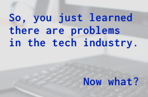

So, you just learned there are issues with the tech industry. Maybe you came here looking to learn more, or maybe someone else linked you to this document and suggested you read it. What now?

# Table of Contents

- *[Hold your questions](#step-0-please-hold-your-questions-until-the-end-of-step-1)*
- *[Educate Yourself](#step-1-educate-yourself)*
  - [Women of Color](#women-of-color)
  - [Gender](#gender)
  - [Race](#race)
  - [General](#general)
- *[Do Something](#step-2-do-something-about-it)*
- *[Keep Educating Yourself](#step-3-keep-educating-yourself)*
  - [Podcasts](#podcasts)
  - [Wiki/Timeline Resources](#wikitimeline-resources)
- *[Bonus Reading](#step-4-bonus-reading)*
  - [Understanding Privilege](#understanding-privilige)
  - [Why Diversity is Important](#why-diversity-is-important)
  - [Sexism](#sexism)
  - [Emotional Overhead and the Second Shift](#emotional-overhead-and-the-second-shift)

# Step 0: Please hold your questions until the end of Step 1.

You’re learning new things and you might want to jump in with both feet. *We get it!*

But some of your friends who have already been here a while might not have the same level of energy. And they really won’t appreciate it if you ask a bunch of questions that are easily Google-able.

It’s important to protect the emotional bandwidth of your [marginalized](https://en.wikipedia.org/wiki/Social_exclusion) friends. They don’t want to be your teacher, they want to engage in discussion with you. But you have to do some up front work to get on their level.

Take a deep breath, have Google opened in a new tab, learn to take really good notes, and get ready for step one.

[Be sure to check out our glossary](https://github.com/stephmarx/so-you-just-learned/blob/master/glossary.md)

# Step 1: Educate Yourself

That’s right, we said educate *yourself*. We’re not going to do it for you.

### Women of Color

*Note: women of color deserve a separate category because of the complications of inhabiting intersectional identities and encountering overlapping bias.*

**[Not a Black Chair](https://medium.com/@amelielamont/not-a-black-chair-8a8e7e2b9140)** - One woman’s story of racism, sexism, and discrimination at Squarespace.

### Gender
**[Antisocial coding: my year at GitHub](http://where.coraline.codes/blog/my-year-at-github/)** - An important, frustrating, heartbreaking read about what happens to marginalized people when HR decides they don't want you anymore.

**["Females" in Open Source](https://modelviewculture.com/pieces/females-in-open-source)** - "Events being ‘open to everyone’ was a token political statement. If they didn’t recognize someone as being part of their in-group, all they had to do was make them uncomfortable. After all, that person is always ‘free’ to leave."

**[Reflecting On One Very, Very Strange Year At Uber](https://www.susanjfowler.com/blog/2017/2/19/reflecting-on-one-very-strange-year-at-uber)** - Possibly the most euphemistic title I’ve ever seen of one of these accounts. Sexism and racism are rampant at Uber. Who knew?

**[The Ping Pong Theory of Tech World Sexism](https://medium.com/matter/the-ping-pong-theory-of-tech-world-sexism-c2053c10c06c)** - Explaining tech world sexism in comic strip form.

**[I Need Terrible Female Engineers](https://medium.com/@amyngyn/i-need-terrible-female-engineers-1023a2e973dd#.x6teafgwf)** - Why it’s exhausting that there are so many exemplary women. Stereotype threat and the pervasive myth of the "exceptional woman" in tech create a barrier that makes women believe they are never good enough. The same could be applied to the “exceptional minority” stereotype that exists in the tech industry.

**[If you think women in tech is just a pipeline problem, you haven't been paying attention](https://medium.com/tech-diversity-files/if-you-think-women-in-tech-is-just-a-pipeline-problem-you-haven-t-been-paying-attention-cb7a2073b996#.2xw2y2f1s)**

### Race

**[Q&A With the Black Twitter Engineer Who Left Over Diversity Problems](http://www.npr.org/sections/codeswitch/2015/11/06/454949422/a-q-a-with-lesley-miley-the-black-twitter-engineer-who-left-over-diversity-probl)** - What it says on the tin :)

**[Conforming to Succeed — A talk about what it means for people of color to succeed in tech](https://www.youtube.com/watch?v=rzzGRHwfyNk)**

**[Bias Doesn't Start with Skin Color - How bias creeps into our hiring and evaluation process](https://chelseatroy.com/2016/08/16/the-problem-is-you-think-its-about-skin-color/)**

### General

**[Why I Won't Make it Past Your Careers Page](https://medium.com/shenomads/why-i-wont-make-it-past-your-careers-page-e7408a67f813)** - A look at how innocuous design decisions in your recruitment efforts can alienate candidates and stall hiring diverse candidates.

**[The Other Side of Diversity](https://medium.com/this-is-hard/the-other-side-of-diversity-1bb3de2f053e)** - "I don’t need to change to fit within my industry. My industry needs to change to make everyone feel included and accepted."

**[When Excellence Isn't Enough](https://medium.com/thelist/when-excellence-isnt-enough-79643e226c6a)** - "No matter how bad it is to talk about, ignoring it is worse."

**[A Hacking Hiatus](https://medium.com/hackers-and-hacking/a-hacking-hiatus-4844ae073d4)**  - "I’ve felt increasingly uncomfortable and often downright disrespected within a community that I helped build.“

# Step 2: Do Something About It

Knowing that there are problems isn’t enough. Pick an organization that helps to improve the tech industry and donate your money or time.

[20/20 Shift](http://www.2020shift.com/)

[AlterConf](https://alterconf.com/)

[Anita Borg Institute](https://anitaborg.org/)

[BIG Accelerator](http://www.digitalundivided.com/accelerate/)

[Black Girls Code](http://www.blackgirlscode.com/)

[CallbackWomen](http://www.callbackwomen.com/)

[ChickTech](https://chicktech.org/)

[Codebar](https://codebar.io/)

[Fundclub](http://joinfundclub.com/)

[Good for POC in Tech](http://goodforpocin.tech/)

[Hypatia Software Organization](https://hypatiasoftware.org/)

[I Need Diverse Games](https://ineeddiversegames.org/)

[People of Color in Tech](http://peopleofcolorintech.com/)

[Trans*H4CK](http://www.transhack.org/)

[TransTech](http://transtechsocial.org/)

[She#](https://www.shesharp.co.nz/)

# Step 3: Keep Educating Yourself

Keep up with current events and developments.

Follow publications and individuals that frequently discuss problems with the tech industry.

#### Podcasts

- **[Greater Than Code](https://www.greaterthancode.com/)** because #PeopleMatter
- **[NPR's Code Switch Podcast](http://www.npr.org/sections/codeswitch/484785516/the-code-switch-podcast)** - We're not as "post-racial" as we like to think
- **[Code Newbie](http://www.codenewbie.org/podcast)** - not strictly about intersectionality or dealing with marginalization, but Saron books a diverse lineup of guests that you should definitely keep an eye on!

#### Wiki/Timeline Resources

**[Timeline of Incidents](http://geekfeminism.wikia.com/wiki/Timeline_of_incidents) of Sexism in Geek Communities** including tech, gaming, comics, etc.

# Step 4: Bonus Reading

More reading for extra credit. These resources might have less to do with tech specifically, but are good resources for getting acquainted with ideas about marginalization and social justice.

### Understanding Privilege

**[Straight White Male: The Lowest Difficulty Setting There Is](http://whatever.scalzi.com/2012/05/15/straight-white-male-the-lowest-difficulty-setting-there-is/)** - Still having a bit of a hard time wrapping your head around the concept of privilege and how it can benefit you without you being aware of it? Here’s a handy metaphor. :)

**[On Nerd Entitlement](http://www.newstatesman.com/laurie-penny/on-nerd-entitlement-rebel-alliance-empire)** - It’s understandable that nerds who felt shunned in high school might not be able to see the privilege that helped them get through. But imagine doing all that and THEN being rejected because of your race or gender.

**[Explaining Privilege to a Broke White Person](http://www.huffingtonpost.com/gina-crosleycorcoran/explaining-white-privilege-to-a-broke-white-person_b_5269255.html)**

### Why Diversity is Important

**[Parable of the Polygons](http://vihart.com/parable-of-the-polygons/)** - Small individual bias can lead to large collective bias. Our segregated past still haunts us, despite reduced bias now. We have to actively call for diversity to correct for de facto segregation. Learn how WITH INTERACTIVE MATH.

**[Alcohol and Inclusivity: Planning Tech Events with Non-Alcoholic Options](https://modelviewculture.com/pieces/alcohol-and-inclusivity-planning-tech-events-with-non-alcoholic-options)** - Plenty of people don’t drink for religious, health, or personal reasons. It’s not really any of our business why someone chooses not to drink, but it *is* our responsibility to make them feel included and not tie career growth and networking opportunities to alcohol consumption.

### Sexism

**[I told my doctor I didn’t want kids. She sent me to a therapist.](http://www.vox.com/first-person/2017/2/20/14617778/woman-no-kids-sterilization)** - Women are *still* treated like they don’t know what’s good for themselves. Their mental health is often questioned if they vocalize not wanting to become parents and instead focus on their careers. Or worse, they’re told they might be failures to their husbands’ expectations if they choose to remain childless. Here is one woman’s story.

**[A female engineer is suing Tesla over sexism and harassment claims](http://www.businessinsider.com/engineer-aj-vandermeyden-is-suing-tesla-for-alleged-sexism-and-harassment-2017-2)** - "In a viral blog post, she alleged that management and HR dismissed her complaints about documented sexual harassment and sexism, protected a repeat offender because he was a "high performer" and suggested that women in the company weren’t as skilled as men."

**[EXCLUSIVE: HOW TO BREAK UP THE SILICON VALLEY BOYS’ CLUB](http://www.vanityfair.com/news/2017/03/how-to-break-up-the-silicon-valley-boys-club-susan-wojcicki)**

**[An Advocate for Women in the Valley Quits Github, Citing Harassment](https://www.wired.com/2014/03/culture-offsets/)**

**[Why Women Leave Tech (infographic)](https://anitaborg.org/insights-tools/infographics/why-women-leave/)**

**[Why women leave tech: It's the culture, not because 'math is hard'](http://fortune.com/2014/10/02/women-leave-tech-culture/)**

**[Delhi Rape Survivor Sues Uber For Illegally Accessing Medical Records](https://inc42.com/buzz/uber-rape-case/)**

### Emotional Overhead and the Second Shift

**[Sealioning: How to Deal with the Time-Wasting Troll Tactic We’re All Tired Of](http://everydayfeminism.com/2017/01/sealioning/)**

**[Derailing for Dummies](http://www.derailingfordummies.com/)** - A satirical guide on how to derail a conversation about social justice. Use this guide to understand the tactics people consciously and unconsciously use to shut down discussion and discredit people’s lived experiences. See also this handy **[Derailment Bingo Card](https://piranha.dreamwidth.org/445505.html)**

**[4 Things Men Are Really Doing When They ‘Play Devil’s Advocate’ Against Feminism](http://everydayfeminism.com/2015/09/playing-devils-advocate/)** - Why your devil’s advocate arguments aren’t as novel or as necessary as you think they are.

**[An Open Letter to Privileged People Who Play Devil’s Advocate](http://feministing.com/2014/05/30/an-open-letter-to-privileged-people-who-play-devils-advocate/)** - A harsher and more direct open letter about devils advocacy, and what it does to people who have to defend themselves against it every day of their lives.

**[Stop Calling Women Nags](http://www.harpersbazaar.com/culture/features/a12063822/emotional-labor-gender-equality/)** - Examples of emotional labor within one woman's life

### Have you found this resource useful?

**[Help us by contributing!](https://github.com/stephmarx/so-you-just-learned/blob/master/contributing.md)**
